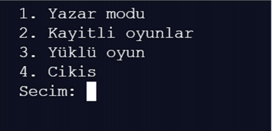
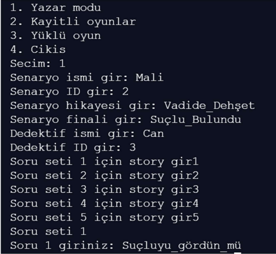
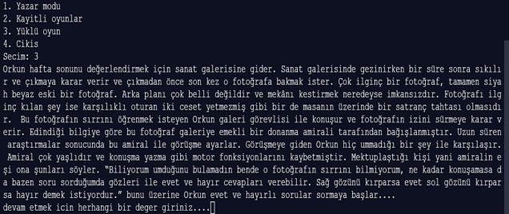
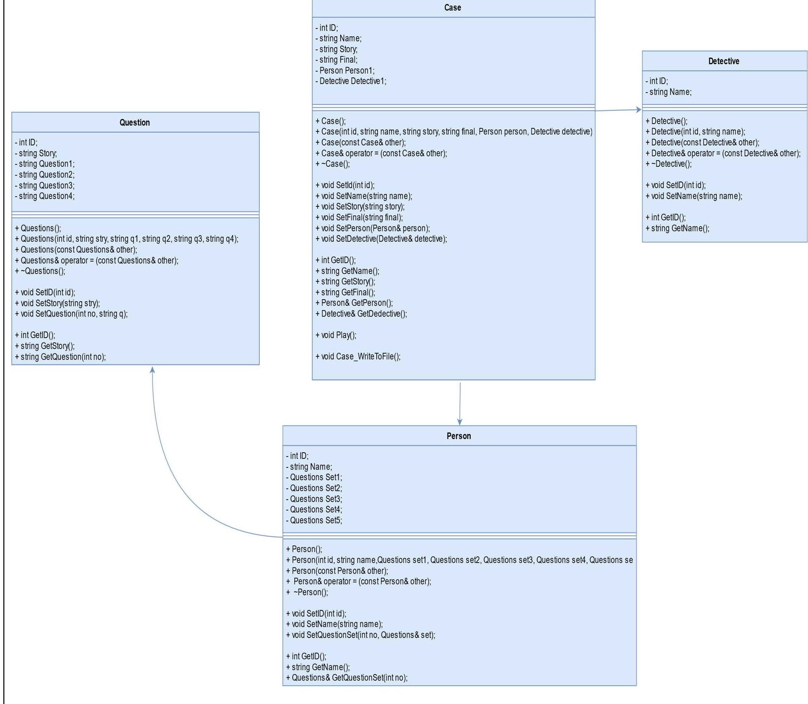
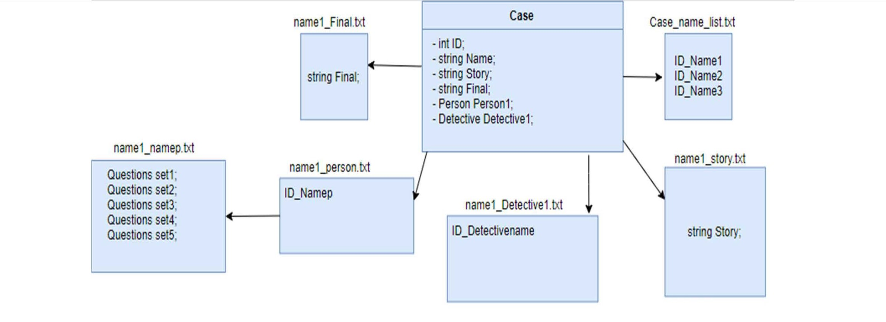

# Dedektif Oyunu (C++ Console)
 
 

### Nedir
> Oyunumuz arkadaşlar arasında keyifle oynan, sözel bir oyun olan [lateral thinking puzzles](https://en.m.wikipedia.org/wiki/Situation_puzzle) diye adlandırılan bir oyun türünden esinlenilmiştir. Oyunda game mastera sorular sorulur ve game master **"evet/hayır"** cevapları dışında başka cevap veremez. Sadece **"evet/hayır"** cevapları ile olay çözülmeye çalışılır.

## Oyun içi
### 1. Yazar modu
> Bu kısımda, yazar senaryo oluşturup kaydedebilir ve yazdığı senaryoyu oyuncuların oynamasını sağlayabilir.

### 2. Oyuncu modu
> Oyuncu, oyun içerisinde kayıtlı oyunlara erişebilir ve demo oyunu oynayabilir

### 3. Görüntüler

## Algoritma tasarımı
### 1. Oynanış
> Oynanış ana class olan Case clası üzerine kurulmuştur. Case clası içerisinde 1 adet Detective 1 adet de Person nesnesi bulunmaktadır. Person clası içerisinde ise 5 adet Question nesnesi bulunmaktadır. Case metodu üzerinden Play metodu çalıştırıldığında ilgili nesneye ait senaryo oynanmaktadır. İlk başta Case nesnesi içerisinde ki story kısmı ekrana yazdırılır ve oyun başlar. Daha sonra Person nesnesi içerisinde ki Qestion nesnesinin birincisi çağrılır ve ekrana 4 soru basılır. Bu 4 sorudan 1’i gereksiz 3 ü ise hikayeye katkısı olan sorulardır. Gerekli olan 3 soru cevaplandığında Question nesnesin de ki story ekrana basılır. Bu kısım dedektifimizi birazcık yönlendirir ve sonraki soru seti çağrılır. Bu şekilde 5 set çağrılır. Amaç gereksiz sorulara takılmadan finale ulaşmaktadır. Finalde ise Case nesnesi içerisinde ki final ekrana bastırılır ve sır perdesi aralanmış olunur.

### 2. Dosyaya yazma 
> Dosyaya yazma işlemi için Case nesnesi içerisin de ki Case_WriteToFile metodu ile gerçekleşir. Case verileri diyagramda gösterildiği gibi parçalanarak farklı dosyalara yazılır. Farklı dosyalara yazılmasın da ki amaç ise okuma işlemini kolaylaştırmaktır.

### 3. Dosyadan okuma 
> Dosyadan okuma işlemleri için gerekli olan fonksiyonlar File.h ve File.cpp dosyası içerisine yazıldı. Burada birçok 
farklı işlevi olan fonksiyon var kimisi soru setlerini okumaktan görevli kimileri ise Person verilerini okumakla görevli. 
Bu fonksiyonlar bir araya geldiklerinde, istediğimiz senaryoya uygun olan verileri çekiyor ve bir Case nesnesine aktarıyor. Daha sonra Play metodunu çağırarak oyunu ynayabilmemizi sağlıyor.

### 4. Yazar modu 
> Bu mod sayesinde yazarlar kendi senaryolarını oyuna dönüştürme şansına sahip oluyorlar. Bir Case nesnesi oluşturuluyor ve veriler kullanıcıdan alınıyor. Daha sonra dosyaya yazma metodu ile kayıt altına alınıyor.

### 5. Uml class diagramı

### 6. Dosya yazma okuma diagramı

## Katkıda Bulunanlar
1. **ÖMER GENÇ**
2. **UĞUR KILIÇ**
3. **UĞUR KILINÇ**
4. **ERKAN BIÇAKÇI**